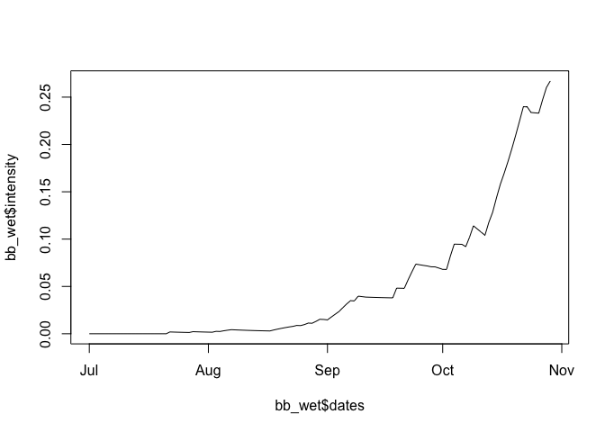
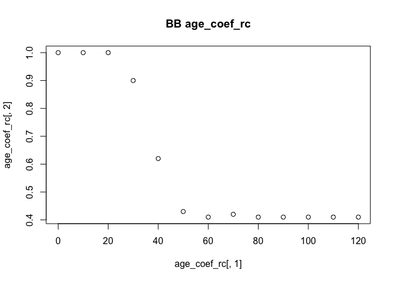
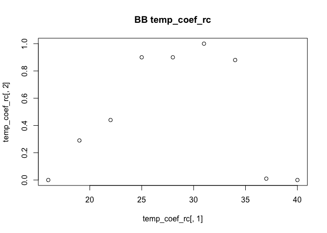
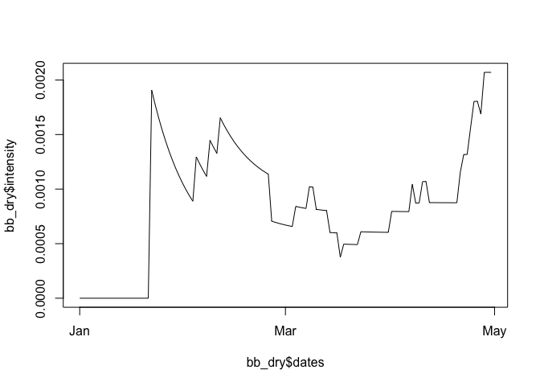

Hands on with epicrop
================
Adam H. Sparks
31/08/2021

This will install *epicrop* from GitHub if you do not already have it
installed.

You can click “Knit” at the top of the window to see the final document
or browse the file on GitHub,
<https://github.com/openplantpathology/hands_on_with_epicrop>.

``` r
if (!require("remotes"))
  install.packages("remotes")
remotes::install_github("adamhsparks/epicrop",
 build_vignettes = TRUE)
```

We have seen how the “EPIRICE” model works and discussed the theory
behind the SEIR model that drives it. Now we will work with the R
package and examine some of these different factors to gain a better
understanding of how the model works.

## The SEIR() function

The `SEIR()` function drives the EPIRICE model. You can view the code on
GitHub in the *epicrop* repository,
<https://github.com/adamhsparks/epicrop/blob/main/R/SEIR.R>. If we look
at the help file for `SEIR()` it will tell us how to use it.

``` r
library("epicrop")
?SEIR()
```

### The parameters

-   `wth`

    The first parameter, `wth`, is a data.frame object of weather to
    drive the model. *epicrop* has relatively simple needs for weather
    to run the model. Daily temperature, relative humidity and rainfall
    are all that are required.

    *epicrop* has a built-in function, `get_wth()` that will
    automatically fetch and format the weather data for use in `SEIR()`
    (or any of the other specialised functions for modelling disease)
    from two possible databases. The default database is the NASA POWER
    API, <https://power.larc.nasa.gov>. The optional database is the
    CHIRPS and CHIRTS APIs, <https://chc.ucsb.edu/data>.

-   `emergence`

    The date that the crop emerges, or if transplanted rice, is
    transplanted.

-   `onset`

    The expected number of days until the onset of disease after
    emergence date (day, integer). Described in Table 1 of Savary *et
    al.* 2012.

-   `duration`

    Simulation duration *i.e.*, growing season length (day, integer).
    Described in Table 1 of Savary *et al.* 2012.

-   `rhlim`

    Relative humidity value threshold to decide whether leaves are wet
    or not (numeric). Savary *et al.* 2012 used 90%.

-   `rainlim`

    Rainfall amount (mm) threshold to decide whether leaves are wet or
    not (numeric). Savary *et al.* 2012 used 5mm.

-   `H0`

    Initial number of plant’s healthy sites (integer). Described in
    Table 1 of Savary *et al.* 2012.

-   `I0`

    Initial number of infective sites (integer). Described in Table 1 of
    Savary *et al.* 2012.

-   `RcA`

    Modifier for *Rc* (the basic infection rate corrected for removals)
    for crop age (numeric vector). Described in Table 1 of Savary *et
    al.* 2012.

-   `RcT`

    Modifier for *Rc* (the basic infection rate corrected for removals)
    for temperature (numeric vector). Described in Table 1 of Savary *et
    al.* 2012.

-   `RcOpt`

    Potential basic infection rate corrected for removals (numeric).
    Derived from Table 1 of Savary *et al.* 2012.

-   `i`

    Duration of infectious period (day, integer). Described in Table 1
    of Savary *et al.* 2012.

-   `p`

    Duration of latent period (day, integer). Described in Table 1 of
    Savary *et al.* 2012.

-   `Sx`

    The maximum number of sites (integer). Described in Table 1 of
    Savary *et al.* 2012.

-   `a`

    The aggregation coefficient, values are from 1 to >1 (numeric).
    Described in Table 1 of Savary *et al.* 2012.

-   `RRS`

    Relative rate of physiological senescence (numeric). Described in
    Table 1 of Savary *et al.* 2012.

-   `RRG`

    Relative rate of growth (numeric). Described in Table 1 of Savary
    *et al.* 2012.

## The “predict” family of functions

Currently *epicrop* provides five pre-parameterised functions to predict
rice diseases. These functions are the EPICROP model as published by
Savary *et al.* 2012.

-   `predict_bacterial_blight()`,
-   `predict_brown_spot()`,
-   `predict_leaf_blast()`,
-   `predict_sheath_blight()`, and
-   `predict_tungro()`

You can view the help file for any of them using the same as above,
`?predict_bacterial_blight`.

## Using the “predict” functions

I have attempted to make it as simple as possible to use these functions
and generate model outputs. Modelling and plotting the disease progress
over time for bacterial leaf blight is as follows.

``` r
# get weather for IRRI Zeigler Experiment Station in wet season 2000
wth <- get_wth(
  lonlat = c(121.25562, 14.6774),
  dates = c("2000-06-30", "2000-12-31"),
  source = "chirps"
)
bb <- predict_bacterial_blight(wth, emergence = "2000-07-01")
plot(x = bb$dates, y = bb$intensity, type = "l")
```

However, right now the POWER data’s precipitation is corrupted and
CHRIPS/CHIRTS are very slow to respond. So, we’ll use some CHIRPS/CHIRTS
data that I downloaded for us to use in these exercises. These data are
for the IRRI Zeigler Experiment Station in Los Baños, Philippines for
2000 and 2001.

``` r
# load them in your R session
chirps <- readRDS("chirps.rds")

# inspect
head(chirps)
```

    ##      YYYYMMDD DOY  TEMP     RHUM RAIN     LAT      LON
    ## 1: 2000-01-01 001 25.69 79.57462    0 14.6774 121.2556
    ## 2: 2000-01-02 002 25.87 78.05478    0 14.6774 121.2556
    ## 3: 2000-01-03 003 24.93 75.99255    0 14.6774 121.2556
    ## 4: 2000-01-04 004 26.09 70.90775    0 14.6774 121.2556
    ## 5: 2000-01-05 005 25.89 74.85828    0 14.6774 121.2556
    ## 6: 2000-01-06 006 26.73 73.04633    0 14.6774 121.2556

``` r
bb_wet <- predict_bacterial_blight(chirps, emergence = "2000-07-01")
plot(x = bb_wet$dates, y = bb_wet$intensity, type = "l")
```

<!-- -->

## Differences in the five functions

If you look at the code for the five functions, you will see that they
each have their own values for the parameters found in `SEIR()`. All of
the functions can be found in the GitHub repository,
<https://github.com/adamhsparks/epicrop/tree/main/R>. We will look at
`predict_bacterial_blight()` first.

On [line
92](https://github.com/adamhsparks/epicrop/blob/b3c85b997180c3f90e67cc02a5e58d62491d9edd/R/predict_bacterial_blight.R#L92)
we see that the `age_coef_rc` is set up as:

``` r
  age_coef_rc <-
    cbind(0:12 * 10,
          c(1, 1, 1, 0.9, 0.62, 0.43, 0.41, 0.42, 0.41, 0.41, 0.41, 0.41, 0.41))
```

and the `temp_coef_rc` is set up as:

``` r
  temp_coef_rc <-
    cbind(16 + (0:8 * 3),
          c(0, 0.29, 0.44, 0.90, 0.90, 1.0, 0.88, 0.01, 0))
```

These values are used in the `RcA` and `RcT` parameters of `SEIR()` to
modify the disease’s progress.

I find it easier to think about how this affects the model by
visualising what this is creating.

``` r
plot(x = age_coef_rc[, 1], y = age_coef_rc[, 2], main = "BB age_coef_rc")
```

<!-- -->

``` r
plot(x = temp_coef_rc[, 1], y = temp_coef_rc[, 2], main = "BB temp_coef_rc")
```

<!-- -->

### Exercise 1

Now, you compare these curves with the curves for leaf blast and answer
the following questions.

1.  How do they differ?

2.  What does this imply about the pathogens and diseases that they
    cause?

Now compare one of the other disease models’ curves with these two and
see how they differ.

All of the code for the disease models are available
[here](https://github.com/adamhsparks/epicrop/tree/main/R).

## RcOpt

We saw `RcOpt` in the presentation. It is the reference potential value
of the basic infection rate corrected for removals for each disease. The
default value for `predict_bacterial_blight()` is 0.87 while for
`predict_leaf_blast()` it is 1.14.

### Exercise 2

Discuss how this value changing affects the disease progress. What does
a higher or lower value for `RcOpt` mean?

## H0, I0 and Sx

Consider the `H0` and `I0` parameters for the different diseases. The
model works for several types of disease, leaf area, whole leaf, tiller,
whole plant all in a 1m^2 area.

### Exercise 3

1.  What are `H0`, `I0` and `Sx`?

2.  How are they related?

3.  Consider how these values might differ between the
    functions/diseases.

4.  Explain how/why these values differ.

5.  a. Are there other scales or plant organs that you would consider if you were adding new diseases?
        b. What disease would these be (does not have to be rice)?
        c. What might the default value be for the new disease?

## p

We did not see `p`, *per se* in the presentation but we did cover the
idea of latent and infectious sites. `p` controls the latent period,
that is how long a site remains in the `E` (exposed) state of SEIR
before becoming infectious.

### Exercise 4

Compare and contrast the different values for `p` from each of the
`predict` functions.

1.  What does this tell you about the pathogens’ life-cycle and
    reproductive strategies?
2.  Which one has the shortest latent period?
3.  Which one has the longest latent period?

## RRS and RRG

The last parameters in the model are `RRS` and `RRG`, or the relative
rate of senescence and the relative rate of growth. Both of these
parameters relate to the crop itself.

Compare the values found in the different `predict` functions.

1.  Which are different and which are the same?
2.  How would changing these values affect the rate of disease progress?

# Working with *epicrop* outputs

`SEIR()` produces data tables that start on day 0, establishment or
emergence and progress to the end of the season, `duration`. By default
in the `predict` functions, this is 120 days for a 120 day rice crop.

There are 16 possible columns, 14 will always be returned with `lat` and
`lon` optionally returned if provided in the `wth` weather input object.
Any values calculated by the model are available at the end of the run.

## Description of fields and values from SEIR() output

1 **simday** Zero indexed day of simulation that was run 2 **dates**
Date of simulation 3 **sites** Total number of sites present on day “x”
4 **latent** Number of latent sites present on day “x” 5 **infectious**
Number of infectious sites present on day “x” 6 **removed** Number of
removed sites present on day “x” 7 **senesced** Number of senesced sites
present on day “x” 8 **ratinf** Rate of infection 9 **rtransfer** Rate
of transfer from latent to infectious sites 10 **rgrowth** Rate of
growth of healthy sites 11 **rsenesced** Rate of senescence of healthy
sites 12 **rlex** Rate of lesion expansion 13 **diseased** Number of
diseased (latent + infectious + removed) sites on 14 **intensity**
Proportion of diseased (latent + infectious + removed) sites per total
sites not including removed sites on day “x” 15 **lat** Latitude value
if provided by `wth` object 16 **lon** Longitude value if provided by
`wth` object

## Comparing seasons

Using the *epifitter* package (Alves and Del Ponte 2021) we can
calculate the area under the disease progress curve (AUDPC) and compare
disease progress in different seasons of the same year.

``` r
if (!require("epifitter"))
  install.packages("epifitter")
```

    ## Loading required package: epifitter

``` r
library("epifitter")
```

The data are already loaded.

``` r
chirps
```

    ##        YYYYMMDD DOY  TEMP     RHUM RAIN     LAT      LON
    ##   1: 2000-01-01 001 25.69 79.57462    0 14.6774 121.2556
    ##   2: 2000-01-02 002 25.87 78.05478    0 14.6774 121.2556
    ##   3: 2000-01-03 003 24.93 75.99255    0 14.6774 121.2556
    ##   4: 2000-01-04 004 26.09 70.90775    0 14.6774 121.2556
    ##   5: 2000-01-05 005 25.89 74.85828    0 14.6774 121.2556
    ##  ---                                                    
    ## 727: 2001-12-27 361 23.30 70.90382    0 14.6774 121.2556
    ## 728: 2001-12-28 362 23.50 72.84994    0 14.6774 121.2556
    ## 729: 2001-12-29 363 24.66 71.80566    0 14.6774 121.2556
    ## 730: 2001-12-30 364 24.41 75.16942    0 14.6774 121.2556
    ## 731: 2001-12-31 365 25.73 74.82427    0 14.6774 121.2556

So we can proceed running the bacterial blight model for the dry season
in the same location. To do this, all that is necessary is to change the
emergence date to January 1, 2000, which corresponds to a 120 day
growing season that starts in the dry season.

``` r
bb_dry <- predict_bacterial_blight(chirps, emergence = "2000-01-01")
plot(x = bb_dry$dates, y = bb_dry$intensity, type = "l")
```

<!-- -->

### Calculating AUDPC

``` r
# wet season
AUDPC(
  time = bb_wet$simday,
  y = bb_wet$intensity,
  y_proportion = FALSE,
  type = "absolute"
)
```

    ## [1] 6.041456

``` r
# dry season
AUDPC(
  time = bb_dry$simday,
  y = bb_dry$intensity,
  y_proportion = FALSE,
  type = "absolute"
)
```

    ## [1] 0.1031549

The AUDPC of the wet season is greater than that of the dry season. So,
this meets the expectations that the wet season AUDPC is higher than the
dry season, which for bacterial blight makes sense as the pathogen needs
leaf moisture and wind to move, infect and reproduce.

### Exercise 5

1.  Explore different emergence dates to find a date with a higher or
    lower AUDPC than the current wet and dry season values. There are
    two years of weather data in the `chirps` data that I’ve provided
    starting from 2000-01-01 to 2001-12-31, which allows for several
    establishment dates to be compared.

2.  Explore the AUDPC for the other diseases in *epicrop*. Which ones
    are worse in the wet season and which are worse in the dry season,
    do some not show as much difference between seasons?
